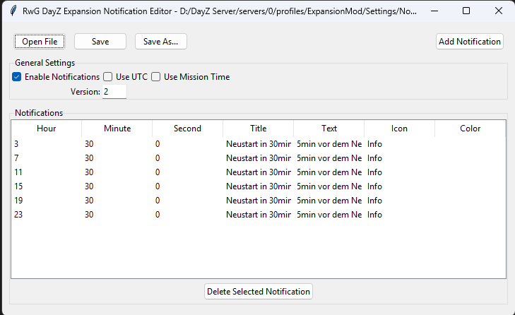
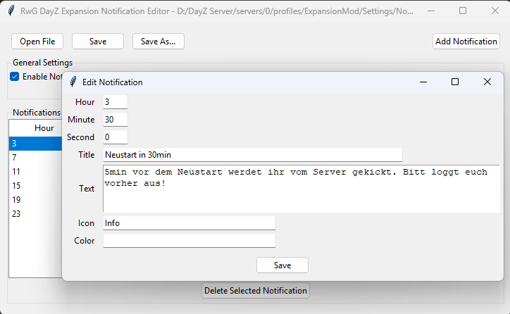

# 🧭 Notification Scheduler Editor – DayZ Expansion

A clean and easy-to-use GUI tool for editing the `NotificationSchedulerSettings.json` file used in **DayZ Expansion**.  
Perfect for server admins who want to manage automated server messages, restarts, and in-game notifications without touching raw JSON.

---

## ✨ Features

- 📂 Load and edit your `NotificationSchedulerSettings.json`
- ➕ Add, ✏️ edit, 🗑 delete notifications
- 🎨 Pick colors with a color picker
- 🖼 Choose and set icons
- ⏱ Set time using hour, minute & second fields with validation
- 💾 Save changes or export new configs
- 🖱 Built with Tkinter (Python) – also available as standalone `.exe`

---

## 📷 Screenshots

> _(Replace with your own screenshots or remove this section if not needed)_

| Main Window                          | Edit Notification                        |
|-------------------------------------|------------------------------------------|
|        |         |

---

## 🧰 How to Use

1. **Open your file**:  
   `profiles\ExpansionMod\Settings\NotificationSchedulerSettings.json`

2. **Edit notifications**:  
   - Double-click to edit
   - Add or delete entries
   - Use the color picker and icon field

3. **Save or export** the modified configuration

---

🛠 For Developers
This project is built with:

Python 3

Tkinter (for GUI)

PyInstaller (to create .exe builds)

To run the editor from source:

python NotificationScheduler.py
To create a standalone executable:

pyinstaller --noconfirm --onefile --windowed NotificationScheduler.py
📦 Download
You can find the latest .exe release under the Releases tab.

🧑‍💻 Contribute
Feel free to open issues or submit pull requests. Suggestions and improvements are always welcome!

## 💡 File Format Example

```json
{
  "m_Version": 2,
  "Enabled": 1,
  "UTC": 0,
  "UseMissionTime": 0,
  "Notifications": [
    {
      "Hour": 7,
      "Minute": 30,
      "Second": 0,
      "Title": "Restart in 30min",
      "Text": "Please log out at least 5 minutes before the restart.",
      "Icon": "Info",
      "Color": "#FFA500"
    }
  ]
}

